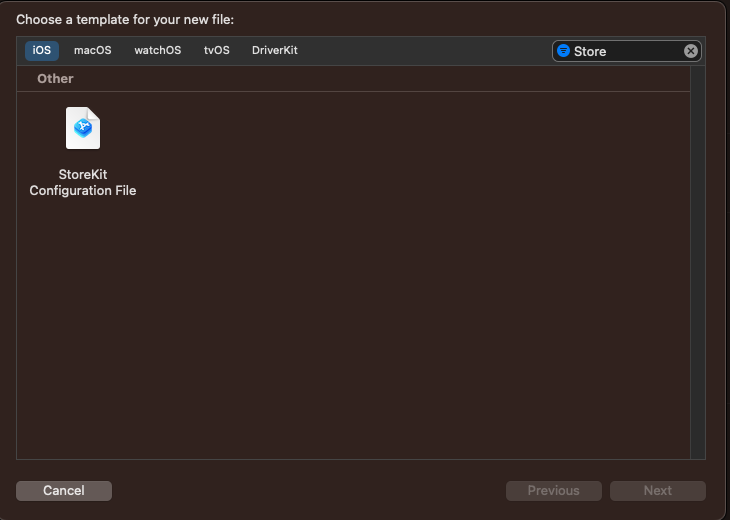
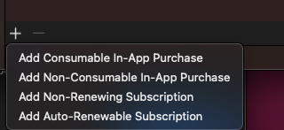
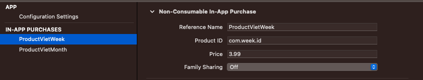
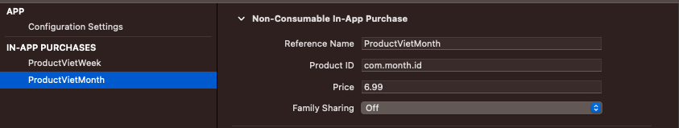
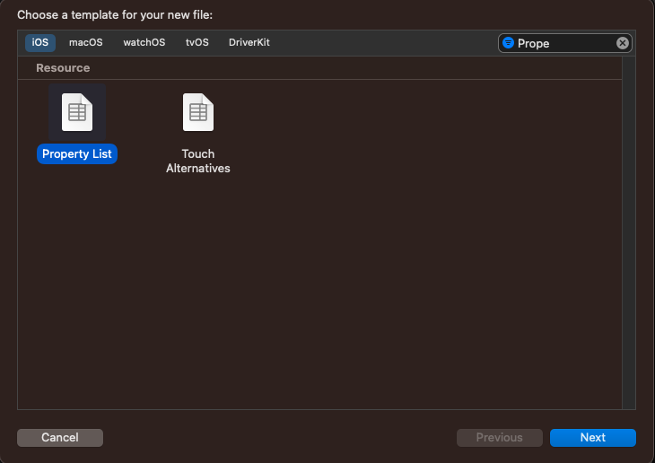
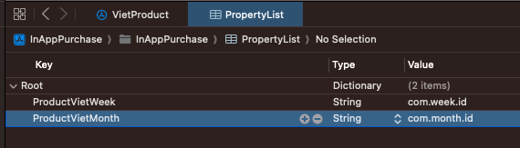

# InApp-Purchase

# I. Các bước thực hiện

1. Add file `StoreKit`, và đặt tên là `VietProduct`

Tích vào file `VietProduct` và ở phần dưới có dấu `+`, ta sẽ được như sau:

Ở đây ta tích tạm `Add non comsumable In-App Purchase`, và tạo 2 `Product` theo `week và month` lần lượt là `ProductVietWeek` và `ProductVietMonth`.

| Product Week | Product Month | 
| :--------: | :--------: | 
|  |  |

2. Add file `Property List` và đặt tên là `PropertyList`

Sau đó ta thêm tên và id lần lượt vào file `ProductList` đó:

